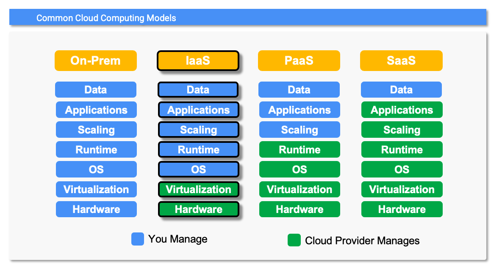

# Infrastructer as a Service

## Overview
With IaaS you are responsible for everything above the virtualization layer.  Think of it as "Virtualization-as-a-Service".  This is the most flexible of the three cloud computing models since you control everything above the virtualization layer.  Your staff is not only responsible for designing, building and supporting the application but they are also responsible for building OS images, standing up and configuring VMs, identifying and managing your storage needs and properly configuring your network resources.  Essentially they have all of the same responsibilities they have with on On-prem solution with the exception of the procurment / deployment / support of the physical assets.

While IaaS does come with the benefit of shifting CapEx costs to OpEx costs (you don't *own* the physical assets... you *rent* them), you still have many of the same costs you would have with an On-Prem model. With IaaS your datacenter staffing / management costs will be somewhat reduced but your people are still responsible for much of the application stack and therfore the *costs* associated with that.  

A huge benefit of IaaS is the speed at which you can implement chage across your organization. Lets say you recognize an opportunity to leapfrog your competition by significantly scaling the deployment of one of your applications globaly.  With the On-prem model it might take you months to get the required hardware ordered and deployed.  With an IaaS cloud hosting solution... it will only take minutes!
## Example Deployment using Google Cloud Build, Packer and Terraform
We will automate our deployment by leveraging [Google Cloud Build](https://cloud.google.com/build?hl=en), [HashiCorp Packer](https://www.packer.io/) and [HashiCorp Terraform](https://www.terraform.io/).  
* __Google Cloud Build__ - A GCP service that automates the process of building, testing and deploying applications.  
* __HashiCorp Packer__ - An open-source tool that automates the creation of machine images across multiple platforms.
* __HashiCorp Terraform__ - An open-source tool that enables you to deploy and manage infrastructure as Code (IaC).

We will break our deployment into two distinct steps: 
* We will use Cloud Build and Packer to package our stock charting application into a runnable OS image.  Step by step instructions along with the necessary artifacts can be found in the [packer](./packer) directory.
* We will use Terraform to stand up a GCE VM running our new OS image (i.e. deploy our application).  Step by step instructions along with the necessary artifacts can be found in the [terraform](./terraform) directory.

 We have significantly simplified our IaaS deployment. If this were a production application we would need to worry about fault tolerance, disaster recovery and scalability.  These concerns can easily be addressed using widely available cloud computing constructs such as managed instance groups, load balancers and multi-region deployments.
