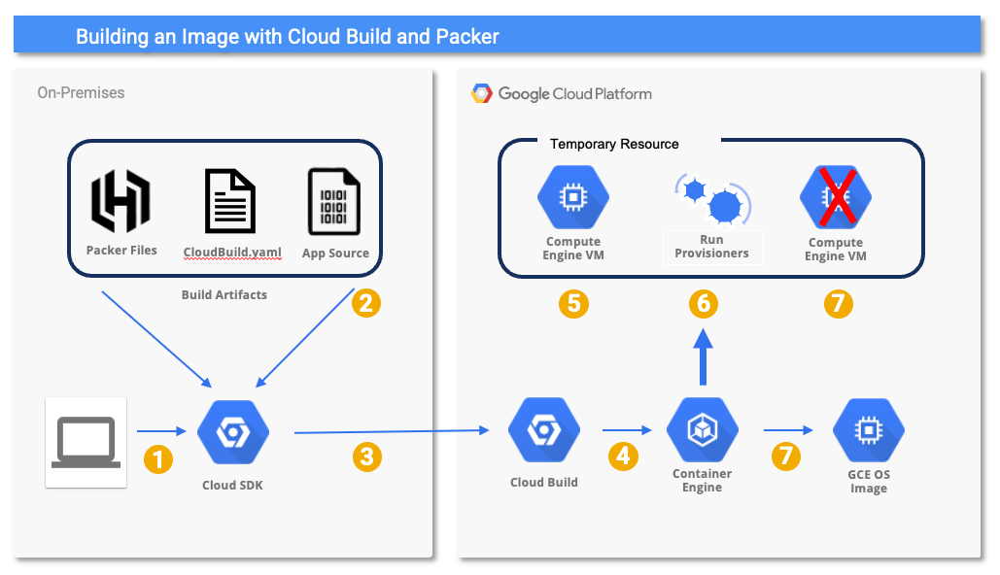

# Building GCE Images with Packer and Cloud Build
### Prerequesites

* Install [Google Cloud CLI](https://cloud.google.com/sdk?hl=en).
* Use gcloud to enable the following APIs:
  ```
  gcloud services enable compute.googleapis.com
  gcloud services enable servicemanagement.googleapis.com
  gcloud services enable storage-api.googleapis.com
  gcloud services enable cloudbuild.googleapis.com
  ```
* Export GCP project variables.  Replace *my-project-id* below with your GCP project identifier.
  ```
  export PROJECT_ID=my-project-id
  export PROJECT_NUMBER=`gcloud projects list --filter="$PROJECT_ID" --format="value(PROJECT_NUMBER)"`
  ```
* Add the necessary IAM Roles to the default service account:
  ```
  gcloud projects add-iam-policy-binding $PROJECT_ID \
  --role="roles/compute.instanceAdmin.v1" \
  --member="serviceAccount:${PROJECT_NUMBER}-compute@developer.gserviceaccount.com"
  ```
  ```
  gcloud projects add-iam-policy-binding $PROJECT_ID \
  --role="roles/artifactregistry.createOnPushWriter" \
  --member="serviceAccount:${PROJECT_NUMBER}-compute@developer.gserviceaccount.com"
  ```
  ```
  gcloud projects add-iam-policy-binding $PROJECT_ID \
  --role="roles/logging.logWriter" \
  --member="serviceAccount:${PROJECT_NUMBER}-compute@developer.gserviceaccount.com"
  ```
  ```
  gcloud projects add-iam-policy-binding $PROJECT_ID \
  --role="roles/storage.objectUser" \
  --member="serviceAccount:${PROJECT_NUMBER}-compute@developer.gserviceaccount.com"
  ```
  ```
  gcloud projects add-iam-policy-binding $PROJECT_ID \
  --role="roles/iam.serviceAccountTokenCreator" \
  --member="serviceAccount:${PROJECT_NUMBER}-compute@developer.gserviceaccount.com"
  ```
  ```
  gcloud projects add-iam-policy-binding $PROJECT_ID \
  --role="roles/iam.serviceAccountUser" \
  --member="serviceAccount:${PROJECT_NUMBER}-compute@developer.gserviceaccount.com"
  ```
    
### Download and Build the Packer Builder Image
Cloud Build provides a community builder docker image that can be used to invoke packer commands via Cloud Build. Before we can use it, we must build it and push it to the Artifact Registry in your GCP project.

* Clone the [cloud-builders-community](https://github.com/GoogleCloudPlatform/cloud-builders-community) repository.
  ```
  git clone https://github.com/GoogleCloudPlatform/cloud-builders-community.git
  ```
* Build the Packer Docker image:
  ```
  cd cloud-builders-community/packer
  gcloud builds submit .
  ```
  
### Configuring Packer Build Variables
* Edit the *variables.pkvars.hcl* in this directory and set the following variables appropriately:
  * `project_id` - your project identifier
  * `zone` - GCP Compute Engine zone for temporary instance
  * `builder_sa` - Build Service Account in the format $(PROJECT_NUMBER)-compute@developer.gserviceaccount.com
 
### Submit Cloud Build
* Submit our packer image build to Google Cloud Build:
  ```
  gcloud builds submit --config=cloudbuild.yaml .
  ```
---
### Cloud Build Details (What's Happening Behind the Curtain)


1. Our build starts when we execute `gcloud builds submit --config=cloudbuild.yaml`.
2. Gcloud packages up the build artifacts specified in our `cloudbuild.yaml`.
3. Gcloud sends our build artifacts to the Google Cloud Build service.
4. Cloud Build runs the build steps defined in our `cloudbuild.yaml` using the appropriate Docker container.
5. A temporary GCE VM is stood up using the source OS specified in our `build.pkr.hcl` file.
6. The provisioners defined in our `build.pkr.hcl` file are run, mutating the OS (installing / configuring our application).
7. The temporary GCE VM is shut down taking special care to __not__ delete the boot disk.
8. A new GCE OS Image is created from the boot disk and the boot disk is deleted.

