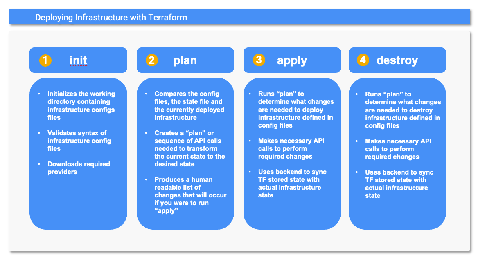

# Deploying GCP Infrastructure with Terraform
### Prerequsites
* Install [Google Cloud CLI](https://cloud.google.com/sdk?hl=en).
* Use gcloud to enable the following APIs:
  ```
  gcloud services enable compute.googleapis.com
  ```
* Install [Terraform](https://developer.hashicorp.com/terraform/install#darwin).
* Terraform must be able to authenticate to Google Cloud in order to use GCP APIs to manage your cloud infrastructure.  You can use the gcloud CLI to create [Application Default Credentials](https://cloud.google.com/docs/authentication/application-default-credentials) that can be used by terraform when it makes calls to GCP APIs.  
  ```
  gcloud auth application-default login
  ```
  
### Terraform State
Terraform must persist state to manager your infrastructure.  It uses `backends` to persist state.  The default backend is a local backend which stores state on the local filesystem, locks that state using system APIs, and performs operations locally.  While using a local backend is not suitable for managing large scale production environments, it is perfectly fine for small scale demos.  We will rely on the default local backend for our example deployment.

### Initialize Terraform
When you initialize terraform it will download the appropriate terraform provider required to interact with your cloud provider, configure the backend to store your state and check your configuration for basic syntax errors.  To initialize terraform run:
  ```
  terraform init
  ```

### Deploy Infrastructure
We have defined the infrastructure we want terraform to deploy in `main.tf`.  This file contains a minimal configuration for a GCE VM running the custom OS image that we created with packer.
* We deploy our infratructure by running terraform apply:
  ```
  terraform apply
  
  Terraform used the selected providers to generate the following execution plan. Resource actions are indicated with the following symbols:
  + create

  Terraform will perform the following actions:

  # google_compute_instance.default will be created
  + resource "google_compute_instance" "default" {
      + can_ip_forward       = false
      + cpu_platform         = (known after apply)
      + creation_timestamp   = (known after apply)
      + current_status       = (known after apply)
      + deletion_protection  = false
  ...
  ...
      + reservation_affinity (known after apply)

      + scheduling (known after apply)
    }

  Plan: 1 to add, 0 to change, 0 to destroy.

  Do you want to perform these actions?
    Terraform will perform the actions described above.
    Only 'yes' will be accepted to approve.

    Enter a value:
  ```
* Before making any changes to our cloud infrastructure, terraform provides us with details on exactly what it is about to do.  Validate that the actions terraform is about to perform on your behalf are what you intend, before answering 'yes' to the prompt.  In our case answering 'yes' to the prompt will result in a GCE VM running our custom OS image we created being stood up which is exactly what we want... so answer __yes__ to the prompt.

### Test Deployment
* Get the __public-ip-address__ for the stock symbol charting application you just deployed:
  ```
  terraform show | grep nat_ip | awk '{print $3 }'
  ```
* Enter `http://[public-ip-address]/chart/goog` in your browser of choice and the application you just deployed will chart the last six months of Google's stock price. 
### Delete Infrastructure
Terraform can not only be used to deploy infrastructure but it can also be used to _undeploy_ or destroy infrastructure you have deployed.  __Note__:  It is important to destroy any infrastructure you deploy in tutorials so that you stop being billed for it :wink:. 

* Run terraform destroy to delete the infrastructure that you have deployed.
  ```
  terraform destroy

  Terraform used the selected providers to generate the following execution plan. Resource actions are indicated with the following symbols:
    - destroy

  Terraform will perform the following actions:

    # google_compute_instance.default will be destroyed
    - resource "google_compute_instance" "default" {
        - can_ip_forward             = false -> null
        - cpu_platform               = "Intel Broadwell" -> null
    ...
    ...
    - shielded_instance_config {
          - enable_integrity_monitoring = true -> null
          - enable_secure_boot          = false -> null
          - enable_vtpm                 = true -> null
        }
    }

  Plan: 0 to add, 0 to change, 1 to destroy.

  Do you really want to destroy all resources?
    Terraform will destroy all your managed infrastructure, as shown above.
    There is no undo. Only 'yes' will be accepted to confirm.

    Enter a value:
  ```
* Verify the changes terraform is about to make on your behalf.  In this case it will destroy (or delete) the GCE VM that we stood up with the apply.  This is exactly what we expect so answer __yes__ to the prompt.
---
### Terraform Details (What's Happening Behind the Curtain)

