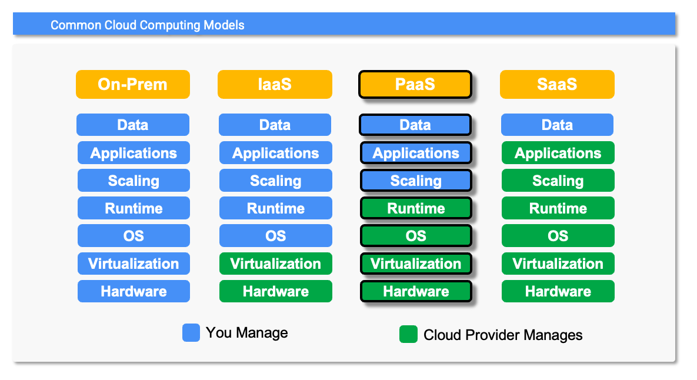

# Platform as a Service



## Overview
PaaS is a cloud computing model that provides the infrastructure and application framework needed to build and deploy cloud computing applications. Developers and operations teams can use PaaS solutions to be freed from managing infrastructure and application frameworks.  This enables them to focus on the *value adding* function of application development and frees them from performing the commoditized functions of infrastructure management and platform support. 

### Responsibility
With PaaS, the cloud provider is responsible for the OS and runtime layers of the application stack along with all of the IaaS layers.  The customer is typically responsible for everything above the runtime layer of the application stack: scaling, application and data.  Some vendors PaaS solutions will even handle application scaling for customers.  Googles [App Engine](https://cloud.google.com/appengine?hl=en) and [Cloud Run](https://cloud.google.com/run?hl=en) PaaS offerings are examples of this.

### Flexibility
When building your applications on PaaS solutions, you will find yourself more constrained than when using IaaS solutions. Since you don't manage the underlying infrastructure or frameworks, your ability to adapt them is restricted to only the features your cloud provider built into the platform itself. For example, a providers platform my not support the latest version of a specific programming language.  That said, a mature PaaS solution is typically flexible enough to provide significant value.

### Operational Load
PaaS solutions require significantly less time to manage and support than IaaS solutions.  Most of the technical complexity of managing and supporting the infrastructure and the application platform is the cloud providers responsibility.  Your engineers need only concern themselves with managing and supporting the applications themselves.

### Staffing / Skills
Customers who leverage PaaS solutions spend less time deploying cloud infrastructue and managing application frameworks, therefore their engineers no longer need to be experts in those areas or perform those tasks.  This enables their engineers to focus more on revenue generating activities like application features that empower their business to move faster and be more productive.

### Total Cost Of Ownership (TCO)
From a cloud billing perspective, PaaS solutions are often more expensive per unit of resource than IaaS solution.  This is due to the added costs of the cloud provider managing more layers of the application stack.  However, when you look at it from a TCO perspective, PaaS solutions are less expensive in the long run because of the decrease in costs caused by the decrease in operation load and staffing / skills.

## Example PaaS Deployment using Google Cloud SDK and Cloud Run

### Prerequsites
* Install [Google Cloud CLI](https://cloud.google.com/sdk?hl=en).
* Use gcloud to enable the following APIs:
  ```
  gcloud services enable run.googleapis.com
  gcloud services enable cloudbuild.googleapis.com
  ```

### Build / Deploy Service
* The Google Cloud SDK CLI (gcloud) enables us to build and deploy our application with a single command.
  ```
  gcloud run deploy --source chart-app
  ```
  * When you are prompted for the service name, press __enter__ and accept the default.
  * If you are prompted to enable any additional APIs respond by entering __y__.
  * When prompted for region, select the region of your choice.
  * If you are prompted to create a repository in the region, respond by enteriing __y__.
  * If you are prompted to *allow unauthenticated invocations*, respond by entering __N__.

* Once you have answered all of the prompts a Docker container will be built from the provided source, it will be pushed to the appropriate repository in the selected region and a Cloud Run service will be started to run your charting application.  This will take a minute or two so be patient.

### Test Service
Our service requires authentication so we will use the [Cloud Run Proxy](https://cloud.google.com/sdk/gcloud/reference/run/services/proxy) to provide it.  This will allow us to send our requests to a service running on localhost that will attach the appropriate credentials and forward the request to the backend service.
* Start the proxy with the command below after replacing *my-project_id* with your project identifier.
  ```
  gcloud run services proxy chart-app --project [my-project-id]
  ```
  * You will be prompted to enter a region for the proxy.  Make sure that you enter the same region you used in the Build / Deployment step.
    
* Hit the charting service enpoint through the local proxy by opening the URL below in a web browser.
  ```
  http://127.0.0.1:8080/chart/goog
  ```
### Delete Service
* Delete the Cloud Run stock symbol charting service.
  ```
  gcloud run services delete chart-app
  ```
  * You will be prompted for a region to delete the service from. Make sure that you enter the same region you used in the Build / Deployment step.
