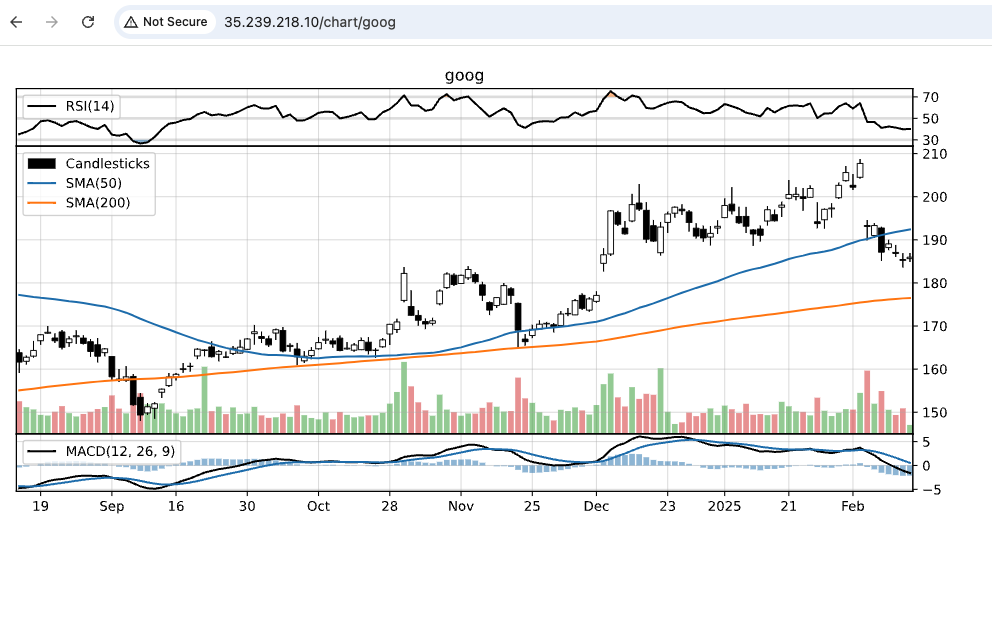

# Public Cloud Hosting Models 

## Overview
This repo explains the differences between the three most common cloud hosting models and it provides an example application deployment for each of the three models using [Google Cloud Platform](https://cloud.google.com/?hl=en).  Before you embark down a cloud computing journey, it is important that you understand the different characteristics of the most common cloud hosting models.  The three main models are __Infrastructure-as-a-Service (IaaS)__, __Platform-as-a-Service (PaaS)__ and __Software-as-a-Service (SaaS)__.

The image above illustrates the different application stack responsibilities for each of the hosting models. As you progress from the left to the right (On-site -> SaaS), your responsibilities decrease and the cloud providers responsibilites increase. For more details on each hosting model see the README in their respective directories in the repo.
* [Infrastructure-as-a-Service (IaaS)](/IaaS/README.md)
* [Platform-as-a-Service (PaaS)](/PaaS/README.md)
* [Software-as-a-Service (SaaS)](/SaaS/README.md)

## Stock Charting Application
For each cloud hosting model, we provide an example deployment of a simple charting application. The application is a python based REST application that graphs the last six months of a companies stock price. It also displays a couple of moving averages and technical indicators.  It returns the graph in Scalable Vector Graphics (svg) format which can easily be displayed by all major web browsers.

### Endpoints
| Method | URL                          | Returns               |
---------|------------------------------|-----------------------|
| GET    | ip_addr/status               | {"status": "OK"}      | 
| GET    | ip_addr/chart/[stock-symbol] | <svg ...> ... <\/svg> |

### Screen Shot

<kbd>

</kbd>
