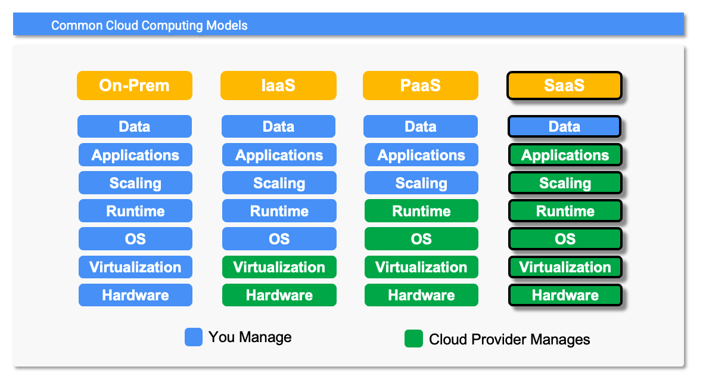

# Software as a Service

## Overview
SaaS is a cloud computing model where the entire application stack is managed and supported by the provider, unlike the other models where the customer has some application stack responsibilities. Typically SaaS applications are accessed through a web browser, requiring little or no local software installation.  Examples of SaaS solutions are gmail or Google Workspaces.

### Responsibilities
With SaaS the cloud provider is responsible for the entire application stack from the physical hardware up to the application code.  The only responsibility the customer has is managing the data or configuration of the system.

### Flexibility
The SaaS model is the least flexible of all the cloud computing models.  You are forced to use the application *as-is*. Your only ability to modify the applications functionality is through leveraging the configuration features the service provider had the foresight to incorporate into the application.

### Operational Load
Since the SaaS provider delivers the entire application over the internet, the only management responsibilities the customers have are maintaining the data and configurations.  Management of the infrastructure, OS, runtime and application code is performed by the SaaS provider.  You will, however, need to provide feedback to the provider in the form of bug reports and feature requests.

### Staffing / Skills
Given that SaaS solution customers no longer have to focus on the application stack, they can spen their time becoming domain experts in the SaaS solutions they use.

### Total Cost of Ownership (TCO)
While there is sometimes *sticker shock* associated with the cost of SaaS solutions, when you consider that you do not have to build the application, are not paying for hardware and don't have to support anything, SaaS solutions are typically the least expensive of the three cloud computing models in the long run.

## Example Deployment using...
Well... um... just click [here](https://www.google.com/finance/quote/GOOG:NASDAQ?hl=en&window=6M).
